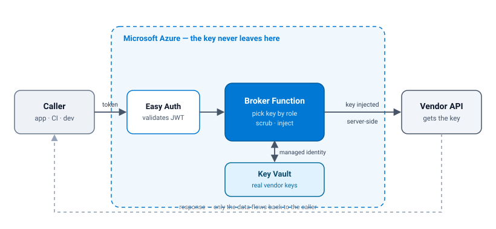
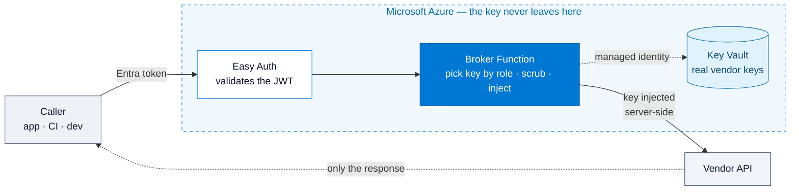

<div align="center">

# Tessera API Broker
### Zero-exposure, plug-in-play API access without distributed vendor keys


<picture>
  <source media="(prefers-color-scheme: dark)" srcset="docs/assets/architecture-dark.svg">
  
</picture>

</div>

---

## Contents

- [What it does](#what-it-does)
- [How a request flows](#how-a-request-flows)
- [Deploy it](#deploy-it)
- [Call it](#call-it)
- [Run an existing app through the bridge](#run-an-existing-app-through-the-bridge)
- [Onboard a vendor](#onboard-a-vendor)
- [Release artifacts](#release-artifacts)
- [Product direction and repository layout](#product-direction-and-repository-layout)
- [Placeholder convention](#placeholder-convention)
- [Verify](#verify)
- [Constraints](#constraints)
- [Networking](#networking)
- [Security](#security)
- [Contributing](#contributing)
- [License](#license)

---

## What it does

A vendor API only answers if you send it a secret key. Normally that key ends up copied onto every
laptop, CI runner, container, and app that needs it.

Broker Bridge keeps that key **once**, on the broker. Callers authenticate as **themselves** with a
Microsoft Entra ID token. The Azure reference broker checks the caller's app role, pulls the matching
key from Key Vault via a managed identity, injects it into the outbound request server-side, and
returns only the vendor's response.

The product direction is a provider- and vendor-agnostic local `broker-bridge` agent. Existing apps
keep their familiar SDK and environment-variable shape, but get the harmless `broker-managed`
placeholder instead of a real vendor key. The local bridge authenticates the caller to an approved
broker; usable vendor credentials stay server-side.

- **Callers hold no vendor secret**, just an identity.
- **Grant and revoke is an Entra role assignment**, not a key rotation across every consumer.
- **The key never leaves Azure.** Not in source, `.env`, repo secrets, logs, traces, dev tools,
  request URLs, or client headers.
- **~$40/month** all-in, versus ~$1,067/month for APIM Standard v2 for the same security properties.
  Trade accounting in spec §1, §12, §13, §14.

Runs as an Azure Function (Flex Consumption, 1 always-ready 2 GiB instance, VNet-integrated) behind
Easy Auth. Supports `header`, `bearer`, `pair`, `basic`, and `oauth2cc` injection modes, so most REST
vendors work without code changes.

## How a request flows



The secure default is **by role**: the caller holds exactly one vendor role, and the bridge consumes
its configured local vendor slug before it forwards the vendor-native path. **By name** is available
only when the broker explicitly enables multi-role routing; then the caller puts the vendor in the
first path segment (`/broker/<vendor>/<subpath>`), and the broker authorizes that role. Naming a
vendor you were not assigned still returns 403.

## Supported runtime

The **Node.js broker** (`function-node/`) is the only supported production broker runtime. The
separate .NET project under `clients/dotnet/` is a supported caller client, released as a
self-contained executable; it is not an alternate broker implementation. This keeps the
production control plane singular while retaining practical clients for common calling environments.

## Deploy it

Full Portal-and-CLI walkthrough: **[docs/SYSADMIN-GUIDE.md](docs/SYSADMIN-GUIDE.md)**.

1. **Use this template** → create your instance repo (e.g. `broker-<org>`).
2. Deploy infra with `iac/foundation.bicep` + `iac/keyvault.bicep`. See
   [`iac/network-design.md`](iac/network-design.md) for the existing-VNet integration.
3. Create the Entra broker app: follow [`identity/app-registration.md`](identity/app-registration.md),
   define app roles from [`identity/app-roles.json`](identity/app-roles.json), apply Easy Auth with
   `iac/auth.bicep`.
4. Deploy the broker, `function-node/` as a Node 22 Flex Consumption zip. Set `KEYVAULT_URI`,
   `ROLE_SECRET_MAP`, and the vendor defaults as app settings.
5. Commit `admin-ui/broker.config.json` (copy `admin-ui/broker.config.example.json`) with your
   subscription, resource group, app, vault, app object ID, and `brandName`.
6. Deploy alerts with `observability/alerts.bicep`.

Template owns code and mechanism; your instance repo owns identity, branding, and releases.

## Call it

Native clients need two non-sensitive values, `BROKER_BASE` and `BROKER_SCOPE`. `BROKER_BASE` is
the broker route root, including `/api/broker`; no vendor credential ever reaches a client.

```bash
# Python — authenticate with your own az login, then call through the broker
export BROKER_BASE=https://broker.contoso.com/api/broker
export BROKER_SCOPE="api://<brokerClientId>/.default"
python3 -c 'from clients.broker_client import get; print(get("/v2/organizations").json())'
```

```python
from clients.broker_client import get, preflight

assert preflight("<vendor-route>")[0] == 200
orgs = get("/v2/organizations")  # no key anywhere
```

Ready-made clients:

| | |
|---|---|
| [`clients/bridge/`](clients/bridge/) | **Drop-in local proxy.** Point an existing app at it with a one-line base-URL change. No code edits, no key on the box. Zero-touch bake-in: [`BAKE-IN.md`](clients/bridge/BAKE-IN.md). |
| [`clients/node/`](clients/node/), [`clients/dotnet/`](clients/dotnet/), [`clients/broker_client.py`](clients/broker_client.py) | Native zero-credential clients. |
| [`clients/setup-pi.sh`](clients/setup-pi.sh) | Headless-device provisioning. |
| [`cicd/call-broker.yml`](cicd/call-broker.yml) | GitHub Actions via OIDC workload identity, so no key in repo secrets. Setup: [`cicd/oidc-setup-runbook.md`](cicd/oidc-setup-runbook.md). |

Getting started locally: [`clients/local-dev-quickstart.md`](clients/local-dev-quickstart.md).

## Run an existing app through the bridge

This is the shortest local path when an app already uses a familiar vendor SDK. No code rewrite and
no vendor key on the machine.

```bash
cd clients/bridge
az login
npm install
npm run init -- --preset openai
# Fill BROKER_BASE and BROKER_SCOPE in broker.env from your broker deployment outputs.
npm run serve
```

Point the app at `http://127.0.0.1:8079/openai/v1` and set its normal API-key variable to
`broker-managed`. The bridge strips caller-supplied credential headers, obtains an Entra token, and
forwards only to the configured broker. `broker.env` contains routing and identity metadata only;
it is not a vendor-secret store.

Or launch the app *through* the bridge in one step — the bridge starts, waits for its own health,
injects the preset environment (base URL + `broker-managed` placeholder), runs the app, and shuts
down cleanly with the app's exit code:

```bash
npm run run -- --preset openai -- node my-app.mjs
```

### Standalone executable

The bridge also ships as a single-file executable, so target machines need no Node or npm:

```bash
npm run bundle    # esbuild single-file CJS bundle (dist/broker-bridge.cjs)
npm run package   # Node SEA binary for this platform (dist/broker-bridge)
./dist/broker-bridge --version
```

Packaging requires an official Node build as the host binary (shared-`libnode` builds cannot host a
SEA blob); the script verifies this and honors a `NODE_SEA_BINARY` override. Tagged releases
(`bridge-v*`) build Linux x64, macOS arm64, and Windows x64 binaries via
`.github/workflows/release-bridge.yml`, with SHA-256 checksums, a CycloneDX SBOM, GitHub build
provenance, and optional Windows Authenticode signing.

The generated profile uses `BROKER_ROUTING_MODE=strict`. Keep it there for the normal one-role
deployment. Set `BROKER_ROUTING_MODE=named` only after the broker owner has deliberately enabled
`MULTI_ROLE_VENDOR_ROUTING=true` for a multi-vendor identity.

## Onboard a vendor

One command per vendor. It creates the Key Vault secret, the app role, the `ROLE_SECRET_MAP` entry,
and the assignment. Idempotent, with `--dry-run`.

```bash
bash cicd/onboard-vendor.sh --vendor graph --inject bearer --dry-run
```

Details and the injection-mode reference: [`cicd/onboarding-runbook.md`](cicd/onboarding-runbook.md).
Grant and revoke afterwards: [`identity/grant-revoke-runbook.md`](identity/grant-revoke-runbook.md).

Prefer clicking? [`admin-ui/`](admin-ui/) is a localhost-only console that loads vendor keys
(write-only) and assigns roles using your own `az login` identity. It stores nothing.

## Release artifacts

Published releases are immutable, checksummed, software-bill-of-materials-backed artifacts:

- **`bridge-v*`** publishes the stateless `broker-bridge` executable for Linux x64, macOS arm64,
  and Windows x64.
- **`client-v*`** publishes the self-contained `broker-client` executable archives for the same
  platforms.

Each release includes `SHA256SUMS`, a CycloneDX SBOM, GitHub build provenance, and the applicable
operator README and Apache-2.0 license. Verify the checksum before execution. The exact artifact
layout, installation, and maintainer release procedure are in [RELEASE.md](RELEASE.md).

## Product direction and repository layout

This repository is still a working Azure reference implementation. The product boundary is now
called out so the local agent can grow without turning its core into Azure-only logic:

| Path | Role |
|---|---|
| [`broker-agent/`](broker-agent/) | Future universal local executable; the current implementation is `clients/bridge/`. |
| [`broker-adapters/`](broker-adapters/) | SDK/environment compatibility adapters. |
| [`broker-protocol/`](broker-protocol/) | Non-secret broker profile and discovery contract. |
| [`providers/azure/`](providers/azure/) | Azure/Entra/Key Vault reference-provider boundary. |
| [`examples/azure-template/`](examples/azure-template/) | Azure deployment example boundary. |

## Current Azure reference layout

| Path | Purpose |
|---|---|
| `spec/azure-api-key-broker-spec.md` | Canonical spec, the source of truth. |
| `spec/broker-bridge-build-spec.md` | Eight-phase plan for the provider- and vendor-agnostic bridge product. |
| `function-node/src/broker.js` | **Deployed broker** (Node 22): role and vendor-named selection, Key Vault fetch + cache, credential scrub, server-side inject, `oauth2cc` token minting. |
| `iac/foundation.bicep` | RG, two subnets on your existing VNet (delegated integration + private endpoint), Flex Consumption Function, private endpoint, private DNS zone, system-assigned MI, App Insights, storage, Easy Auth. |
| `iac/modules/private-endpoint-subnet.bicep` | Private endpoint subnet + the **NSG that enforces the IP allow/deny list**. |
| `iac/keyvault.bicep` | Key Vault (soft-delete + purge protection, RBAC), one secret per vendor key, MI scoped to **only** the vendor-key secrets. |
| `iac/auth.bicep`, `iac/network-design.md`, `iac/outputs.json` | Easy Auth config, VNet reuse, deploy-time outputs. |
| `identity/` | App registration guide, role → secret map, grant/revoke runbook. |
| `cicd/` | One-command vendor onboarding, GitHub OIDC federation, sample workflow. |
| `clients/` | Bridge proxy, native clients, dev quickstart, developer security runbook, key-free sample env. |
| `observability/` | Alerts (4xx/5xx/latency/cold-start/KV-anomaly/cost), per-`oid` and per-key dashboards, access-review cadence. |
| `admin-ui/` | Localhost-only admin console. |
| `test/` | Test plan, acceptance matrix, rotation and rollout runbooks, token-claim assertion, smoke bars. |
| `docs/SYSADMIN-GUIDE.md` | Portal UI + `az` CLI deployment guide. |

## Placeholder convention

GUIDs in this repo are placeholders, substituted at deploy time and grep-findable via `PLACEHOLDER`:

- `tenantId` = `11111111-1111-1111-1111-111111111111` (`tenantIdPlaceholder: true`)
- `brokerClientId` = `00000000-0000-0000-0000-000000000000` (`brokerClientIdPlaceholder: true`)
- `appIdUri` = `api://00000000-0000-0000-0000-000000000000`
- `issuer` = `https://login.microsoftonline.com/11111111-1111-1111-1111-111111111111/v2.0`
- hostname = `broker.contoso.com`

## Verify

```bash
# Artifact + negative-match gate scans. No Azure credentials needed.
bash test/run-smoke-bars.sh

# Broker behavioral tests (mocked Azure SDK, real handler)
npm test --prefix function-node

# Release-relevant client and bridge checks
npm test --prefix clients/bridge
node --test clients/node/test/*.test.mjs
python3 -m unittest clients.test_broker_config clients.test_broker_preflight clients.test_broker_client_integration
dotnet build clients/dotnet/NinjaBrokerClient.csproj --no-restore --nologo -v q
```

Bar-by-bar evidence is in [`test/results.md`](test/results.md); the parity matrix is
[`test/acceptance-matrix.md`](test/acceptance-matrix.md).

## Constraints

These are enforced, not aspirational. The smoke bars scan for violations.

- **Vendor keys never reach a client.** Not in source, `.env`, repo or Actions secrets, logs,
  traces, browser dev tools, request URLs, client headers, or on any device. In the Azure reference,
  they stay in Key Vault and are injected server-side.
- **Your existing network is untouched.** The template only *adds* two subnets, an NSG, a private
  endpoint, and a private DNS zone to a VNet you already have. It never creates or modifies your VNet
  peering, gateways, routes, appliances, or tunnels; those are referenced read-only.
- **`az` CLI only.** No Azure MCP server is referenced anywhere.

## Networking

Inbound reaches the broker **only** through a private endpoint in your existing VNet, with public
network access disabled. The IP allow/deny list is enforced by an **NSG on the private endpoint
subnet**. Set `onPremIngressCidr` / `vpnClientCidr` to whitelist, `blockedSourceCidrs` to blacklist.

> **The one thing to get right:** App Service access restrictions are *not* evaluated for private
> endpoint traffic. [Microsoft is explicit](https://learn.microsoft.com/en-us/azure/app-service/overview-access-restrictions#how-it-works)
> that "restrictions to private endpoints are configured using network security groups." The NSG is
> the filter. `ipSecurityRestrictions` remains in the template only as defense-in-depth on the
> disabled public endpoint.

**Before callers can reach it, on-prem DNS must conditionally forward `privatelink.azurewebsites.net`
to a resolver inside the VNet** (Azure DNS Private Resolver inbound endpoint or an existing
forwarder). That is an operator prerequisite, not something this template deploys. If the org has no
forwarder today, price it before committing; it can exceed the broker's own cost. Full detail,
verification steps, and the access-restriction-only fallback (`deployPrivateEndpoint: false`) are in
[`iac/network-design.md`](iac/network-design.md).

## Security

Found a vulnerability? **Do not open a public issue.** See [SECURITY.md](SECURITY.md) for private
reporting, scope, and the threat model.

Operating it safely:

- [`clients/developer-security-runbook.md`](clients/developer-security-runbook.md) covers prohibited
  key locations and what to do if a key is suspected exposed.
- [`observability/rbac-governance.md`](observability/rbac-governance.md) covers the quarterly access
  review, the least-privilege checklist, and offboarding.
- [`test/rotation-runbook.md`](test/rotation-runbook.md) covers key rotation with cache-bust.

## Contributing

Bug reports, vendor injection modes, and client ports are welcome. Fix bugs **here** in the template,
not in your instance repo. Read [CONTRIBUTING.md](CONTRIBUTING.md) for the dev setup and the
pre-commit checklist.

## License

[Apache License 2.0](LICENSE). Copyright 2026 CloudMarsh.
