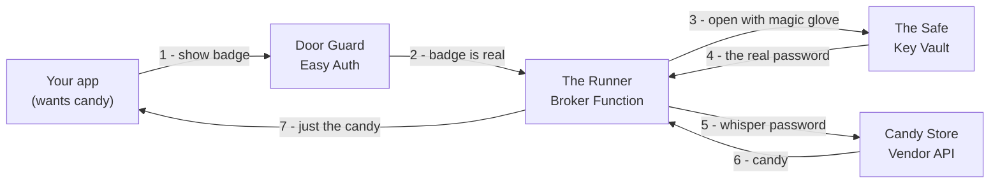

# The whole thing, explained like you're 5

## The big idea

There's a **Candy Store** (a company's API) that only gives you candy if you whisper a **secret
password** (an API key). The problem: if every kid carries the password around, it gets dropped,
copied, and stolen.

So instead, we hire a **Runner**. The Runner is the only one who knows the password. You don't ask
the store for candy, you ask the *Runner*, and the Runner goes and gets it for you. **You never learn
the password.** To prove you're allowed to ask, you show a **badge** (who you are) with **stickers**
(what you're allowed to get). A **Door Guard** checks your badge is real before you can even talk to
the Runner.

That's this whole project: a Runner-with-a-safe so apps get their candy without ever holding the
password.

---

## Layer by layer

### The Candy Store: the vendor API

The outside company (Salesforce, Microsoft Graph, HCSS, whoever) that has the data you want. It's the
whole reason a password exists in the first place. From its side nothing changes: it hands over candy
to anyone who whispers a valid password, and it never finds out *which kid* actually asked. All it
ever sees is the Runner.

### The Safe: Key Vault · `iac/keyvault.bicep`

A locked safe where every password lives, because passwords need one guarded home instead of being
scattered across a hundred pockets.

Two things make it more than a box with a lid. Only the Runner's special glove opens it, and the
glove is only allowed to reach the *one* password it needs for the errand it's on. That second part
is the one people skip, and it's the one that turns "someone got in" from a catastrophe into a
nuisance. A mistake can never spill all of them at once.

### The Magic Glove: the managed identity

The Runner's own hand. There is **no password for the Safe written down anywhere**. The glove just
works, because it *is* the Runner, and Azure vouches for that directly.

Think about why that matters: if opening the Safe needed its own password, we'd be right back where
we started, guarding a secret with another secret. With the glove there's nothing to steal and
nothing to rotate.

### The Runner: the Broker Function · `function-node/src/broker.js`

The little program that runs the errand. It is the *only* thing that ever touches a real password,
which is exactly why it's the only thing we have to guard carefully.

Every trip is the same five steps:

1. Read your stickers.
2. Pick the right password for the store you asked about.
3. Open the Safe with the glove.
4. Empty its pockets of any fake passwords you sent along.
5. Whisper the real password to the store, and hand you back *only* the candy.

The password never leaves the building.

### Emptying your pockets: the credential scrubber · `function-node/src/credential-scrubber.js`

Before the Runner leaves, it turns your request's pockets inside out and throws away anything that
looks like a password. Yours is ignored on purpose, so nobody can sneak their own key through or
confuse the store into using it.

### The Door Guard: Easy Auth · `iac/auth.bicep`

A guard at the door who checks your badge is real *before the Runner ever hears you*. Fake badge or
no badge, you're turned away right there, and the Runner never spends a second on you. By the time
anyone gets to talk to the Runner, they've already proved who they are.

### The badge and the School Office: Entra ID

Microsoft Entra ID is the school office that hands every kid, and every app, a photo ID badge that's
very hard to fake. Everything else in this project hangs off *knowing who is asking*, and this is
where that knowledge comes from.

One office serves the whole school. Add a kid, remove a kid, or suspend a kid in one place, and every
door in the building respects it immediately.

### The stickers: app roles · `identity/app-roles.json`, `identity/app-registration.md`

Colored stickers on your badge. Each one means permission to send the Runner to a specific store: a
"Salesforce" sticker, a "Graph" sticker, and so on. Being *known* isn't enough on its own; we also have
to say what you're allowed to get.

Handing out access is peeling stickers on and off, and no password ever changes hands. A kid can hold
several stickers, but each password answers to a specific badge, so it stays tidy. The runbook is
`identity/grant-revoke-runbook.md`.

> **One grown-up rule.** Normally a kid names the store and the Guard checks they have the matching
> sticker. That "name-the-store" mode is a switch (`MULTI_ROLE_VENDOR_ROUTING`) and it's **off by
> default**, so the strict old rule stays the default: exactly one sticker, or you're turned away.

### The desk Walkie-Talkie: the bridge · `clients/bridge/`

A tiny helper that sits on your desk. Your app already knows how to call a store, so you point it at
the Walkie-Talkie instead and it relays to the Runner using your badge.

The point is that nobody has to rewrite an existing app. Change **one line** (the store's address),
**delete the password**, and the app doesn't notice anything happened. See `clients/bridge/BAKE-IN.md`
for baking it in so the person using the app does nothing at all.

### Pre-made Walkie-Talkies: the native clients · `clients/node`, `clients/dotnet`, `clients/broker_client.py`

Every app speaks a different language, so there's a ready-made walkie-talkie for each one. Copy,
paste, go. Nobody needs to invent their own way of talking to the Runner.

### The private hallway: the network / VNet · `iac/foundation.bicep`, `iac/network-design.md`

The corridors you walk to reach the Runner. You can lock them so people arrive only through the
school's own hallways (VPN) rather than off the street.

Yes, everyone reaching the Runner already has a valid badge. That's not a reason to let the whole
planet knock on the door. Fewer doors means fewer ways in.

### The LEGO instructions: Infrastructure-as-Code · `iac/`

Step-by-step build instructions (Bicep files) for the Safe, the Runner's desk, the Guard post, and
the hallway. Build the same clubhouse every time, never forget a wall. A new store, a new client, or
a whole new clubhouse is reproducible instead of guesswork.

### The robot builders: CI/CD · `cicd/`

Robot workers (GitHub Actions) that read the LEGO instructions and build and deploy everything for
you, because humans forget steps and robots don't.

They use a one-time handshake (`cicd/oidc-setup-runbook.md`) so the robots don't need a password of
their own either. And `cicd/onboard-vendor.sh` is a one-button machine that teaches the Runner about
a brand-new store: it adds the store's password to the Safe, makes a new sticker, and writes down the
address.

### The cameras and logbook: observability · `observability/`

Security cameras and a notebook recording who asked the Runner to go where and whether it worked,
plus alarms when something looks wrong. You need to see what's happening, and you need to be woken up
if it breaks.

The logbook writes down everything **except the passwords**, so you get the full story with none of
the secrets. Governance lives in `observability/rbac-governance.md`.

### The grown-up's control panel: admin UI · `admin-ui/`

A dashboard for handing out and removing stickers and refilling passwords, so managing this doesn't
mean memorizing commands. Point-and-click the everyday chores; the risky parts stay in the Safe.

### The safety inspectors: tests · `test/`

Inspectors who try the sneaky tricks on purpose: fake badges, wrong stickers, expired passwords. The
whole point is catching a mistake before a real bad guy does. `test/acceptance-matrix.md` and the
smoketests are the proof that the rules actually hold.

### The pretend clubhouse: demo · `demo/`

A tiny working example you can run to watch the whole thing happen, because seeing beats reading.
Nothing in here is real, so it's a safe place to learn or to show someone else.

### The rulebook: the spec · `spec/azure-api-key-broker-spec.md`

The big book of rules that everyone follows, including every clubhouse built from this template. It
keeps every build behaving the same way and stops anyone inventing their own unsafe shortcut. When
something is ambiguous, this is what the project points back to.

---

## Grown-up glossary (metaphor → the real thing)

| ELI5 | Real thing | Where |
|---|---|---|
| Candy store | Vendor API (Salesforce, Graph, HCSS…) | external |
| Secret password | Vendor API key / secret | Key Vault |
| The Safe | Azure Key Vault | `iac/keyvault.bicep` |
| Magic glove | System-assigned managed identity | the Function |
| The Runner | Broker Azure Function | `function-node/src/broker.js` |
| Emptying pockets | Caller-credential scrubbing | `function-node/src/credential-scrubber.js` |
| Door Guard | Easy Auth (platform token validation) | `iac/auth.bicep` |
| School office / badge | Microsoft Entra ID + access token | Entra tenant |
| Stickers | Entra app roles (assignment-required) | `identity/app-roles.json` |
| Name-the-store switch | `MULTI_ROLE_VENDOR_ROUTING` | `broker.js` app setting |
| Desk walkie-talkie | The bridge (local drop-in proxy) | `clients/bridge/` |
| Pre-made walkie-talkies | Native clients | `clients/node|dotnet|python` |
| Private hallway | VNet / private ingress | `iac/network-design.md` |
| LEGO instructions | Infrastructure-as-Code (Bicep) | `iac/` |
| Robot builders | CI/CD (GitHub Actions + OIDC) | `cicd/` |
| One-button new-store | `onboard-vendor.sh` | `cicd/` |
| Cameras & logbook | Observability + alerts | `observability/` |
| Control panel | Admin console | `admin-ui/` |
| Safety inspectors | Test suite | `test/` |
| Rulebook | The spec | `spec/` |

**The one sentence to remember:** *you prove who you are and the Runner uses the password for you, so
the password never lands in your pocket, and access is something a grown-up grants or takes away with
a sticker instead of a secret.*
